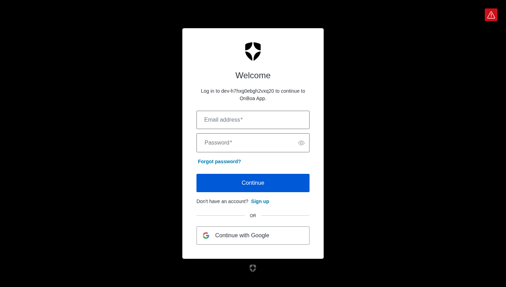
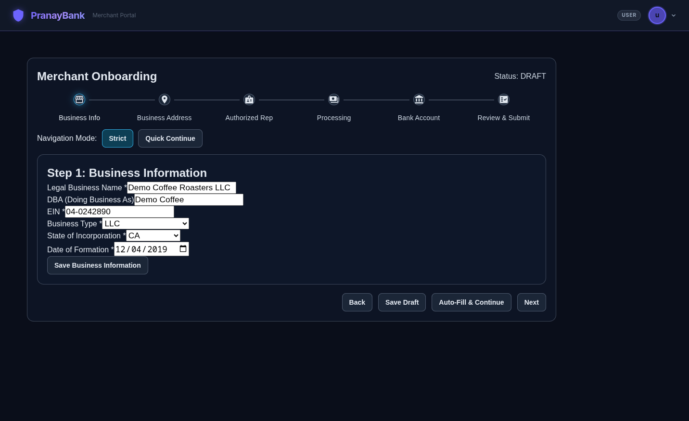
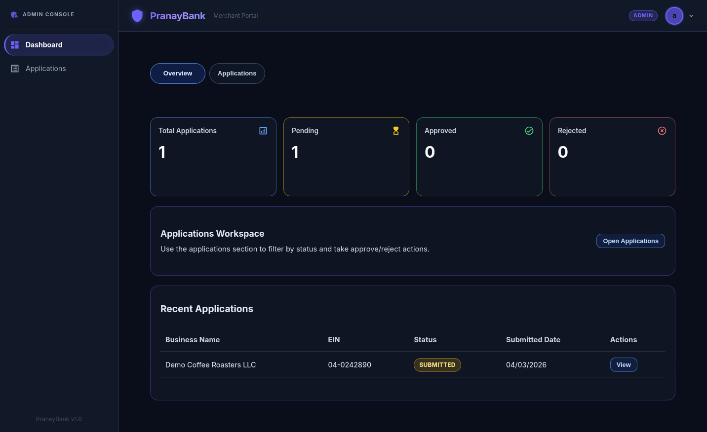
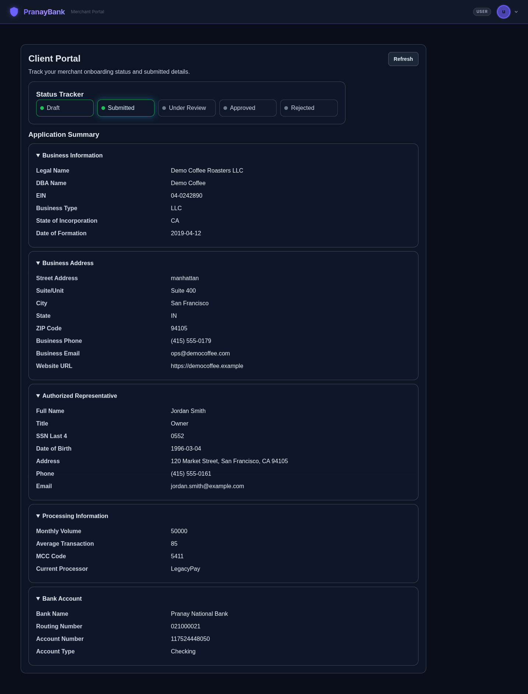
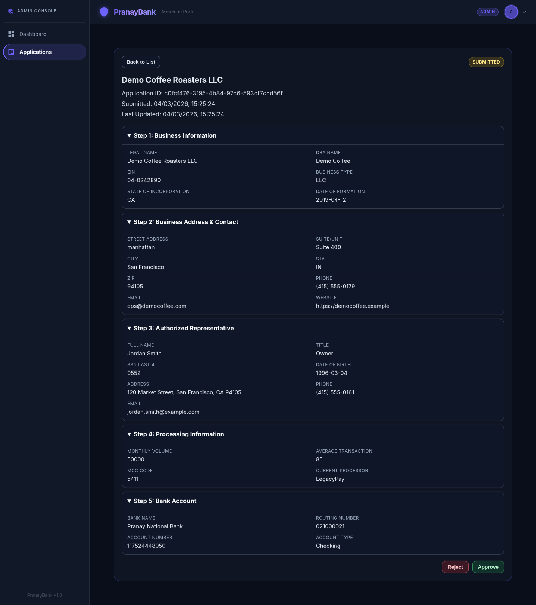

# PranayBank — B2B Merchant Onboarding Platform

> A full-stack, microfrontend-based B2B merchant onboarding platform built with React 18 (Vite + Module Federation) and Spring Boot 3.x, secured by Auth0.

---

## 📸 Screenshots

| Landing / Login                              | Onboarding Stepper                                         | Admin Dashboard                                |
| -------------------------------------------- | ---------------------------------------------------------- | ---------------------------------------------- |
|  |  |  |

| Submitted Application                                                        | Admin Approve / Reject                                                 |
| ---------------------------------------------------------------------------- | ---------------------------------------------------------------------- |
|  |  |

---

## ✨ Features

### Merchant (`USER` role)

- Self-register via Auth0 signup
- Complete a **6-step onboarding wizard** (Business Info → Address → Authorized Rep → Processing Info → Bank Account → Review & Submit)
- Auto-save drafts on step navigation; resume where you left off
- Track application status in a visual progress stepper
- View assigned Merchant ID (`PB-XXXXXXXX`) after approval
- Edit and resubmit if rejected

### Bank Admin (`ADMIN` role)

- Pre-seeded accounts (no self-registration)
- View all applications with filtering by status and date range
- Quick-stats dashboard: Total / Pending / Approved / Rejected
- Approve or reject applications with optional admin notes
- Status transition generates a unique Merchant ID on approval

---

## 🏗️ Architecture

```
┌──────────────────────────────────────────────────────┐
│                    FRONTEND (React 18)                │
│                                                       │
│  ┌─────────────┐  ┌──────────────┐  ┌──────────────┐ │
│  │  Shell App  │  │ Onboarding   │  │  Dashboard   │ │
│  │  (Host)     │◄─┤ MFE (Remote) │  │ MFE (Remote) │ │
│  │  · Layout   │  │ · 6-step     │  │ · Admin      │ │
│  │  · Routing  │  │   stepper    │  │   views      │ │
│  │  · Auth     │  │ · Draft save │  │ · Stats      │ │
│  │  · Nav      │  │ · Client     │  │ · Approve /  │ │
│  │             │  │   portal     │  │   Reject     │ │
│  └──────┬──────┘  └──────────────┘  └──────────────┘ │
│         │         Vite + Module Federation             │
└─────────┼────────────────────────────────────────────┘
          │ HTTPS (JWT Bearer)
          ▼
┌───────────────────────────┐     ┌──────────────────┐
│   Spring Boot 3.x Backend │────►│  Neon PostgreSQL  │
│   (Java 17)               │     │  (Free Tier)      │
│   · REST APIs             │     └──────────────────┘
│   · Auth0 JWT validation  │
│   · JPA / Hibernate       │     ┌──────────────────┐
│   · Role-based access     │────►│  Auth0            │
│                           │     │  (OIDC Provider)  │
└───────────────────────────┘     └──────────────────┘
```

### MFE Apps at a Glance

| App              | Type   | Dev Port | Responsibilities                                         |
| ---------------- | ------ | -------- | -------------------------------------------------------- |
| `shell-app`      | Host   | **3000** | Layout, routing, Auth0 provider, role-based route guards |
| `onboarding-mfe` | Remote | **3001** | 6-step stepper form, draft save, client portal           |
| `dashboard-mfe`  | Remote | **3002** | Admin dashboard, application list, approve/reject, stats |

---

## 🛠️ Tech Stack

| Layer              | Technology                                                   |
| ------------------ | ------------------------------------------------------------ |
| Frontend Framework | React 18                                                     |
| Bundler / MFE      | Vite 5 + `@originjs/vite-plugin-federation`                  |
| UI Components      | MUI (Material UI) v5                                         |
| State Management   | TanStack Query (server state) + React Context + `useReducer` |
| HTTP Client        | Axios                                                        |
| Auth (Frontend)    | `@auth0/auth0-react`                                         |
| Backend            | Spring Boot 3.x (Java 17)                                    |
| Security           | Spring Security + OAuth2 Resource Server (Auth0 JWT)         |
| ORM                | Spring Data JPA + Hibernate                                  |
| Database           | Neon PostgreSQL                                              |
| API Style          | REST — `/api/v1/...`                                         |
| Deployment         | Vercel (3 MFEs) + Render.com (backend) + Neon (DB)           |

---

## 🚀 Local Development

### Prerequisites

- Java 17+
- Node.js 18+
- An Auth0 tenant (see [Auth0 Setup](#-auth0-setup) below)
- A PostgreSQL-compatible database — [Neon](https://neon.tech) free tier recommended

### 1 — Backend

```bash
# Standard run (needs a live Postgres DB)
cd backend && ./mvnw spring-boot:run

# Dev profile — uses H2 in-memory DB, relaxed auth
cd backend && ./mvnw spring-boot:run -Dspring-boot.run.profiles=dev
```

The API starts on **`http://localhost:8080`**.

Verify:

```bash
curl http://localhost:8080/actuator/health
```

### 2 — Frontend MFEs

> **Important:** Start the remote MFEs **before** the shell app so federation can find them.

```bash
# Terminal 1 — Onboarding MFE (port 3001)
cd frontend/onboarding-mfe && npm install && npm run dev

# Terminal 2 — Dashboard MFE (port 3002)
cd frontend/dashboard-mfe && npm install && npm run dev

# Terminal 3 — Shell App / Host (port 3000)
cd frontend/shell-app && npm install && npm run dev
```

App is available at **`http://localhost:3000`**.

### Environment Variables

Each app reads secrets from a `.env` file (not committed). Copy the `.env.example` if it exists, or create manually:

**`backend/src/main/resources/application.yml`** uses env vars:

```yaml
# Never hardcode — set these in your shell or CI/CD
spring.datasource.url: ${DB_URL}
spring.datasource.username: ${DB_USERNAME}
spring.datasource.password: ${DB_PASSWORD}
auth0.audience: ${AUTH0_AUDIENCE}
spring.security.oauth2.resourceserver.jwt.issuer-uri: ${AUTH0_ISSUER_URI}
```

**`frontend/shell-app/.env`**:

```env
VITE_AUTH0_DOMAIN=YOUR_AUTH0_DOMAIN
VITE_AUTH0_CLIENT_ID=YOUR_AUTH0_CLIENT_ID
VITE_AUTH0_AUDIENCE=https://pranaybank-api
VITE_API_BASE_URL=http://localhost:8080/api/v1
```

> Add `.env` files to `.gitignore` — they are already listed there.

---

## 🔐 Auth0 Setup

| Setting                        | Value                                                                      |
| ------------------------------ | -------------------------------------------------------------------------- |
| Application Type               | Single Page Application (SPA)                                              |
| Allowed Callback URLs          | `http://localhost:3000/callback`, `https://pranaybank.vercel.app/callback` |
| Allowed Logout URLs            | `http://localhost:3000`, `https://pranaybank.vercel.app`                   |
| API Identifier (Audience)      | `https://pranaybank-api`                                                   |
| Roles                          | `ADMIN`, `USER`                                                            |
| Custom JWT Claim (Action/Rule) | `https://pranaybank.com/roles` → array of user roles                       |

### Admin Provisioning

- Admin accounts are **pre-seeded** in the Auth0 dashboard by a super-admin.
- Admin self-registration is **not supported**.
- Merchant users can self-register via the normal Auth0 signup flow.

> [!NOTE]
> If a user lands on the wrong route, verify the role claim payload at `https://pranaybank.com/roles` in the decoded JWT.

---

## 🔄 Application Status Workflow

```
[*] ──► DRAFT ──► SUBMITTED ──► UNDER_REVIEW ──► APPROVED
                                      │
                                      └──► REJECTED ──► DRAFT (re-edit)
```

| Status         | Description                                           |
| -------------- | ----------------------------------------------------- |
| `DRAFT`        | User is still filling out the form                    |
| `SUBMITTED`    | Completed and submitted by the merchant               |
| `UNDER_REVIEW` | An admin has started reviewing                        |
| `APPROVED`     | Approved — a Merchant ID (`PB-XXXXXXXX`) is generated |
| `REJECTED`     | Rejected — user can edit and resubmit                 |

---

## 📡 API Overview

All endpoints are prefixed with `/api/v1` and require a `Authorization: Bearer <JWT>` header.

### Merchant (USER)

| Method | Endpoint                      | Description                         |
| ------ | ----------------------------- | ----------------------------------- |
| `POST` | `/applications`               | Create a new draft application      |
| `GET`  | `/applications/me`            | Get current user's application      |
| `PUT`  | `/applications/{id}/step/{n}` | Save data for a specific step (1–5) |
| `POST` | `/applications/{id}/submit`   | Submit completed application        |

### Admin (ADMIN)

| Method | Endpoint                          | Description                        |
| ------ | --------------------------------- | ---------------------------------- |
| `GET`  | `/admin/applications`             | List all applications (filterable) |
| `GET`  | `/admin/applications/{id}`        | View full application detail       |
| `PUT`  | `/admin/applications/{id}/status` | Approve or reject                  |
| `GET`  | `/admin/stats`                    | Dashboard quick stats              |

### User Management (USER / ADMIN)

| Method | Endpoint      | Description                                |
| ------ | ------------- | ------------------------------------------ |
| `POST` | `/users/sync` | Sync Auth0 user to local DB on first login |
| `GET`  | `/users/me`   | Get current user profile                   |

---

## ☁️ Deployment

| Service        | Platform   | URL                                |
| -------------- | ---------- | ---------------------------------- |
| Shell App      | Vercel     | `pranaybank.vercel.app`            |
| Onboarding MFE | Vercel     | `pranaybank-onboarding.vercel.app` |
| Dashboard MFE  | Vercel     | `pranaybank-dashboard.vercel.app`  |
| Backend API    | Render.com | `pranaybank-api.onrender.com`      |
| Database       | Neon       | (connection string via env var)    |

> [!NOTE]
> Render.com free tier has ~30 s cold starts after inactivity. This is expected for a demo environment.

CI/CD is handled by GitHub Actions with separate pipelines for each sub-app, triggered on path-filtered pushes to `main`.

---

## 📁 Repository Structure

```
onboa/
├── backend/                   # Spring Boot API
│   └── src/main/java/com/pranaybank/onboarding/
│       ├── controller/
│       ├── service/
│       ├── repository/
│       └── entity/
├── frontend/
│   ├── shell-app/             # Host MFE (port 3000)
│   ├── onboarding-mfe/        # Remote MFE (port 3001)
│   └── dashboard-mfe/         # Remote MFE (port 3002)
├── images/                    # App screenshots
└── README.md
```
