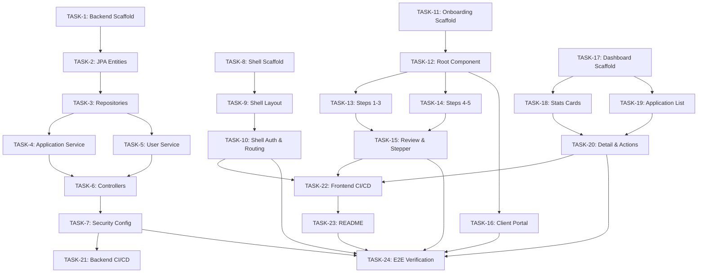

# PranayBank — Engineering Task Breakdown

> Derived from [prd.md](file:///home/pran/anotherDrive/synecodes/onboa/docs/prd.md) and [implementation_plan.md](file:///home/pran/anotherDrive/synecodes/onboa/docs/implementation_plan.md)  
> Each task is independently testable, affects limited files, and includes acceptance criteria.

---

## Phase 1 — Backend (Spring Boot)

### TASK-1: Project Scaffold & Dependencies

**Scope**: Initialize the Spring Boot 3.x project with all required Maven dependencies.

**Files**:

- `backend/pom.xml`
- `backend/src/main/resources/application.yml`
- `backend/src/main/java/.../PranayBankOnboardingApplication.java`

**Work**:

- Create Spring Boot project (Java 17)
- Add dependencies: Spring Web, Spring Data JPA, Spring Security OAuth2 Resource Server, PostgreSQL driver, Lombok, DevTools
- Configure `application.yml` with placeholder Auth0 issuer-uri, Neon DB connection string, CORS origins, server port

**Acceptance Criteria**:

- [ ] `./mvnw clean compile` completes without errors
- [ ] `application.yml` contains `spring.security.oauth2.resourceserver.jwt.issuer-uri` placeholder
- [ ] `application.yml` contains PostgreSQL datasource config (url, username, password)
- [ ] CORS config allows `localhost:3000`, `localhost:3001`, `localhost:3002`

---

### TASK-2: JPA Entities — Core Data Model

**Scope**: Create all 7 JPA entity classes with UUID primary keys and relationships per the ER diagram.

**Files**:

- `backend/src/main/java/.../entity/MerchantUser.java`
- `backend/src/main/java/.../entity/OnboardingApplication.java`
- `backend/src/main/java/.../entity/BusinessInfo.java`
- `backend/src/main/java/.../entity/BusinessAddress.java`
- `backend/src/main/java/.../entity/AuthorizedRep.java`
- `backend/src/main/java/.../entity/ProcessingInfo.java`
- `backend/src/main/java/.../entity/BankAccount.java`
- `backend/src/main/java/.../enums/ApplicationStatus.java`

**Work**:

- `MerchantUser` — UUID id, auth0Id (unique), email, role, createdAt
- `OnboardingApplication` — UUID id, FK to MerchantUser, status enum, currentStep, merchantId (unique, nullable), adminNotes, createdAt/updatedAt/submittedAt
- `BusinessInfo`, `BusinessAddress`, `AuthorizedRep`, `ProcessingInfo`, `BankAccount` — each 1:1 with `OnboardingApplication`
- `ApplicationStatus` enum: `DRAFT`, `SUBMITTED`, `UNDER_REVIEW`, `APPROVED`, `REJECTED`

**Acceptance Criteria**:

- [ ] All 7 entities compile with correct JPA annotations (`@Entity`, `@Id`, `@GeneratedValue`, `@OneToOne`, etc.)
- [ ] `OnboardingApplication` has cascade and bidirectional relationships to the 5 sub-entities
- [ ] `MerchantUser.auth0Id` has `@Column(unique = true)`
- [ ] `ApplicationStatus` enum has all 5 values
- [ ] `./mvnw clean compile` passes

---

### TASK-3: JPA Repositories

**Scope**: Create Spring Data JPA repositories for `MerchantUser` and `OnboardingApplication`.

**Files**:

- `backend/src/main/java/.../repository/MerchantUserRepository.java`
- `backend/src/main/java/.../repository/OnboardingApplicationRepository.java`

**Work**:

- `MerchantUserRepository` — `findByAuth0Id(String auth0Id)`
- `OnboardingApplicationRepository` — `findByMerchantUserAuth0Id(String auth0Id)`, `findByStatus(ApplicationStatus status)`, count queries for stats

**Acceptance Criteria**:

- [ ] Both repositories extend `JpaRepository<Entity, UUID>`
- [ ] Custom query methods follow Spring Data naming conventions
- [ ] `./mvnw clean compile` passes

---

### TASK-4: Application Service — CRUD & Status Workflow

**Scope**: Implement the core business logic for application lifecycle management.

**Files**:

- `backend/src/main/java/.../service/ApplicationService.java`

**Work**:

- `createApplication(auth0Id)` — creates DRAFT, enforces one active per user (PRD: FORM-04)
- `getMyApplication(auth0Id)` — returns active application
- `saveStepData(appId, step, data, auth0Id)` — saves form data per step (1–5), updates `currentStep`
- `submitApplication(appId, auth0Id)` — transitions `DRAFT → SUBMITTED`, validates all 5 steps exist, sets `submittedAt`
- `getAllApplications(status)` — filterable list for admins
- `updateStatus(appId, newStatus, adminNotes)` — admin approve/reject with valid transitions, generates `PB-XXXXXXXX` merchant ID on approval
- `getStats()` — returns total, pending, approved, rejected counts
- `validateStatusTransition()` — enforces state diagram rules

**Acceptance Criteria**:

- [ ] Creating two applications for same user throws/returns existing one
- [ ] Step save for steps 1–5 correctly maps JSON data to respective child entities
- [ ] Submit fails if application is not in `DRAFT` status
- [ ] Approval generates unique merchant ID in `PB-XXXXXXXX` format
- [ ] Rejection allows re-edit (status goes back to `DRAFT`)
- [ ] Stats returns correct counts per status
- [ ] `./mvnw clean compile` passes

---

### TASK-5: User Service — Auth0 Sync

**Scope**: Implement local DB sync for Auth0 users on first login.

**Files**:

- `backend/src/main/java/.../service/UserService.java`

**Work**:

- `syncUser(auth0Id, email, role)` — upserts `MerchantUser` on first login
- `getUserByAuth0Id(auth0Id)` — fetch profile

**Acceptance Criteria**:

- [ ] First call creates a new `MerchantUser` record
- [ ] Subsequent calls with same `auth0Id` return existing user (idempotent)
- [ ] Role is extracted from JWT claims and stored
- [ ] `./mvnw clean compile` passes

---

### TASK-6: REST Controllers — Application & Admin & User Endpoints

**Scope**: Implement all 3 REST controllers per the API contract.

**Files**:

- `backend/src/main/java/.../controller/ApplicationController.java`
- `backend/src/main/java/.../controller/AdminController.java`
- `backend/src/main/java/.../controller/UserController.java`
- `backend/src/main/java/.../controller/GlobalExceptionHandler.java`

**Work**:

- `ApplicationController` — `POST /api/v1/applications`, `GET /me`, `PUT /{id}/step/{stepNumber}`, `POST /{id}/submit`, `GET /{id}`
- `AdminController` — `GET /api/v1/admin/applications` (filterable), `GET /{id}`, `PUT /{id}/status`, `GET /stats`
- `UserController` — `POST /api/v1/users/sync`, `GET /me`
- `GlobalExceptionHandler` — `@ControllerAdvice` for consistent error responses

**Acceptance Criteria**:

- [ ] All endpoints match the API contract (method, path, request/response)
- [ ] JWT principal (`@AuthenticationPrincipal Jwt`) is used for user identity
- [ ] User can only access own applications (ownership check in `GET /{id}`)
- [ ] Admin endpoints return 403 for non-admin users (handled by security config)
- [ ] Error handler returns structured JSON errors with proper HTTP status codes
- [ ] `./mvnw clean compile` passes

---

### TASK-7: Security Config — OAuth2 Resource Server + CORS

**Scope**: Configure Spring Security for Auth0 JWT validation and role-based access.

**Files**:

- `backend/src/main/java/.../config/SecurityConfig.java`
- `backend/src/main/java/.../config/AudienceValidator.java`

**Work**:

- OAuth2 Resource Server with JWT validation against Auth0 issuer
- `AudienceValidator` — validates `aud` claim
- Path-based security: `/api/v1/admin/**` requires `ADMIN` role, `/api/v1/applications/**` requires `USER` role, `/api/v1/users/**` permits both
- CORS configuration for frontend origins
- CSRF disabled (stateless API)

**Acceptance Criteria**:

- [ ] Unauthenticated requests to protected endpoints return 401
- [ ] USER role cannot access `/api/v1/admin/**` (returns 403)
- [ ] ADMIN role can access admin endpoints
- [ ] CORS headers present in responses for allowed origins
- [ ] `./mvnw spring-boot:run` starts without errors (with valid DB config)

---

## Phase 2 — Shell App (Host MFE)

### TASK-8: Shell App Scaffold & Module Federation Host Config

**Scope**: Create the Vite + React 19 host application with Module Federation configuration.

**Files**:

- `frontend/shell-app/package.json`
- `frontend/shell-app/vite.config.js`
- `frontend/shell-app/index.html`
- `frontend/shell-app/src/main.jsx`

**Work**:

- Initialize Vite + React 19 project
- Configure `@originjs/vite-plugin-federation` as host, consuming remotes: `onboarding@<URL>/assets/remoteEntry.js`, `dashboard@<URL>/assets/remoteEntry.js`
- Shared deps: `react`, `react-dom`, `react-router-dom`, `@auth0/auth0-react`, `@tanstack/react-query`
- Set up Auth0Provider, QueryClientProvider, MUI ThemeProvider (dark theme), BrowserRouter in `main.jsx`
- Environment variables: `VITE_AUTH0_DOMAIN`, `VITE_AUTH0_CLIENT_ID`, `VITE_AUTH0_AUDIENCE`, `VITE_API_URL`

**Acceptance Criteria**:

- [ ] `npm install` succeeds
- [ ] `npm run dev` starts dev server on port 3000
- [ ] `npm run build` produces clean build output
- [ ] Module Federation config lists both remotes
- [ ] Auth0Provider wraps the entire app with env-based config
- [ ] QueryClientProvider wraps the host app and is initialized once in `main.jsx`

---

### TASK-9: Shell App Layout & Navigation

**Scope**: Implement the shell layout with Navbar, Sidebar, and content area.

**Files**:

- `frontend/shell-app/src/App.jsx`
- `frontend/shell-app/src/components/Navbar.jsx`
- `frontend/shell-app/src/components/Sidebar.jsx`
- `frontend/shell-app/src/index.css`

**Work**:

- `Navbar` — PranayBank logo (left), nav links (center), user avatar + logout button (right)
- `Sidebar` — admin-only, links: Dashboard, Applications
- `App.jsx` — flex layout: sidebar (if admin) + main column (navbar + content area)
- Global styles in `index.css` (dark theme base, glassmorphism cards, gradient accents)

**Acceptance Criteria**:

- [ ] Navbar displays logo, user info, and logout
- [ ] Sidebar only renders when user has ADMIN role
- [ ] Layout uses CSS flexbox with sidebar + main content
- [ ] Dark theme with consistent color palette (#0A0E1A background, #6C63FF primary)
- [ ] Responsive: sidebar collapses on smaller screens

---

### TASK-10: Shell App Auth & Routing

**Scope**: Implement Auth0 login flow, role-based route guards, and MFE lazy-loading.

**Files**:

- `frontend/shell-app/src/App.jsx`
- `frontend/shell-app/src/components/ProtectedRoute.jsx`
- `frontend/shell-app/src/pages/LandingPage.jsx`

**Work**:

- `ProtectedRoute` — checks `user['https://pranaybank.com/roles']` against `allowedRoles` prop
- Landing page for unauthenticated users with login CTA
- Lazy-load `OnboardingApp` from `onboarding/OnboardingApp` and `DashboardApp` from `dashboard/DashboardApp`
- Route config: `/onboarding/*` (USER only), `/dashboard/*` (ADMIN only)
- Auto-redirect: ADMIN → `/dashboard`, USER → `/onboarding`
- Error boundary for failed MFE loads

**Acceptance Criteria**:

- [ ] Unauthenticated users see landing page
- [ ] After login, ADMIN users are redirected to `/dashboard`
- [ ] After login, USER users are redirected to `/onboarding`
- [ ] USER cannot navigate to `/dashboard` (gets redirected)
- [ ] ADMIN cannot navigate to `/onboarding`
- [ ] Failed MFE load shows graceful error message (not blank screen)

---

## Phase 3 — Onboarding MFE (Remote)

### TASK-11: Onboarding MFE Scaffold & API Service

**Scope**: Create the Vite + React 19 remote MFE with Module Federation config and API service layer.

**Files**:

- `frontend/onboarding-mfe/package.json`
- `frontend/onboarding-mfe/vite.config.js`
- `frontend/onboarding-mfe/index.html`
- `frontend/onboarding-mfe/src/main.jsx`
- `frontend/onboarding-mfe/src/services/api.js`

**Work**:

- Initialize Vite + React 19 project
- Module Federation remote config: exposes `./OnboardingApp`
- Shared deps: `react`, `react-dom`, `react-router-dom`, `@auth0/auth0-react`, `@tanstack/react-query`
- API service: authenticated Axios instance using `getAccessTokenSilently`, methods for `create`, `getMine`, `getById`, `saveStep`, `submit`
- Set up QueryClientProvider in `main.jsx` with shared query keys for application reads/writes

**Acceptance Criteria**:

- [ ] `npm install && npm run dev` starts on port 3001
- [ ] `npm run build` generates `remoteEntry.js` in output
- [ ] API service creates Axios instance with Bearer token interceptor
- [ ] All 5 application API methods match the API contract
- [ ] QueryClientProvider is configured in `main.jsx` with onboarding application query keys

---

### TASK-12: Onboarding Root Component & State Management

**Scope**: Build the root `OnboardingApp` component that manages application state and routes between stepper and portal.

**Files**:

- `frontend/onboarding-mfe/src/OnboardingApp.jsx`
- `frontend/onboarding-mfe/src/hooks/useApplication.js`
- `frontend/onboarding-mfe/src/state/ApplicationProvider.jsx`
- `frontend/onboarding-mfe/src/state/applicationReducer.js`

**Work**:

- On mount: sync user (`POST /users/sync`) via mutation flow, then load existing application (`GET /applications/me`) via query
- State architecture (hybrid):
  - Server state: TanStack Query (`useQuery`/`useMutation`) for `application`, network loading/error, retries, and cache invalidation
  - UI workflow state: React Context + `useReducer` for `activeStep`, local draft-edit flags, and view-specific UI errors
- Handler contracts in `useApplication`: `createApplication`, `saveStep`, `submitApplication`, and `refetchApplication` (hook-level helper only)
- Query invalidation strategy: successful create/save/submit invalidates application query keys instead of callback-based child refresh
- Routing logic in `OnboardingApp`: show `OnboardingStepper` if no app / `DRAFT` / `REJECTED`, show `ClientPortal` if `SUBMITTED` / `UNDER_REVIEW` / `APPROVED`
- Component responsibility split:
  - `OnboardingApp`: layout + status-based view routing only
  - `ApplicationProvider`/`useApplication`: API orchestration and state transitions

**Acceptance Criteria**:

- [ ] Component syncs user on first load
- [ ] Shows loading spinner while initial query/mutation bootstrap runs
- [ ] Routes to stepper for DRAFT/REJECTED/new applications
- [ ] Routes to ClientPortal for SUBMITTED/UNDER_REVIEW/APPROVED
- [ ] `createApplication`, `saveStep`, `submitApplication` are exposed through `useApplication` (not passed through deep prop chains)
- [ ] Successful create/save/submit invalidates application query keys and rehydrates latest server state
- [ ] `OnboardingStepper` and step components consume state/actions from provider hook without callback-based `onRefresh`

---

### TASK-13: Stepper Form — Steps 1–3 (Business Info, Address, Authorized Rep)

**Scope**: Implement the first three step forms of the onboarding wizard.

**Files**:

- `frontend/onboarding-mfe/src/components/steps/BusinessInfoStep.jsx`
- `frontend/onboarding-mfe/src/components/steps/BusinessAddressStep.jsx`
- `frontend/onboarding-mfe/src/components/steps/AuthRepStep.jsx`

**Work**:

- **BusinessInfoStep**: Legal Name, DBA, EIN (XX-XXXXXXX format), Business Type dropdown (LLC/Corp/Sole Prop/Partnership/Non-Profit), State dropdown, Date of Formation picker
- **BusinessAddressStep**: Street, Suite/Unit, City, State dropdown, ZIP (5 or 9 digit), Phone (US format), Email, Website URL
- **AuthRepStep**: Full Name, Title, SSN last 4 (masked), DOB (18+ validation), Address, Phone, Email
- Each step: controlled inputs, field-level validation, pre-populated from existing application data
- Steps consume persisted application data and save actions from `useApplication` directly (no intermediate prop-drilling contract)

**Acceptance Criteria**:

- [ ] Each step renders all fields per PRD Section 4.2
- [ ] Required fields show validation errors when empty on blur/submit
- [ ] EIN validates 9-digit XX-XXXXXXX format
- [ ] ZIP validates 5-digit or 9-digit format
- [ ] DOB validates age ≥ 18
- [ ] SSN last 4 uses masked input
- [ ] Fields pre-populate when resuming a draft
- [ ] Step save actions call provider hook mutations and trigger query invalidation/reload

---

### TASK-14: Stepper Form — Steps 4–5 (Processing Info, Bank Account)

**Scope**: Implement the remaining data-entry step forms.

**Files**:

- `frontend/onboarding-mfe/src/components/steps/ProcessingInfoStep.jsx`
- `frontend/onboarding-mfe/src/components/steps/BankAccountStep.jsx`

**Work**:

- **ProcessingInfoStep**: Monthly Volume ($, number), Avg Transaction ($ number), MCC Code (dropdown+search from pre-populated list), Current Processor (optional)
- **BankAccountStep**: Bank Name, Routing Number (9-digit ABA), Account Number (masked), Confirm Account Number (must match), Account Type (Checking/Savings radio)
- Controlled inputs, validation, pre-population from draft

**Acceptance Criteria**:

- [ ] Processing step renders all 4 fields with correct input types
- [ ] MCC code dropdown is searchable with pre-populated MCC list
- [ ] Bank Account step validates routing number is 9 digits
- [ ] Account Number confirmation must match (shows error if mismatch)
- [ ] Account Number fields use masked/password display
- [ ] Fields pre-populate when resuming a draft

---

### TASK-15: Stepper Form — Step 6 (Review & Submit) + Stepper Container

**Scope**: Implement the review/summary step and the main stepper container with navigation.

**Files**:

- `frontend/onboarding-mfe/src/components/steps/ReviewStep.jsx`
- `frontend/onboarding-mfe/src/components/OnboardingStepper.jsx`
- `frontend/onboarding-mfe/src/index.css`

**Work**:

- **ReviewStep**: Read-only display of all Steps 1–5 data in sections, "Edit" links per section (navigates to that step), Terms & Conditions checkbox, E-Signature checkbox, Submit button (disabled until both checked)
- **OnboardingStepper**: MUI Stepper (horizontal, 6 steps with icons/labels), active step highlight + completed checkmarks, Next/Back/Save Draft buttons, auto-save on step navigation (PRD: FORM-01), step rendering switch, error/success snackbar
- `OnboardingStepper` consumes `activeStep` and actions from reducer-backed provider; it does not act as a callback transport layer
- Styles: Glow connector between steps, glass-effect paper containers

**Acceptance Criteria**:

- [ ] Stepper shows 6 steps with labels and icons
- [ ] Active step is highlighted, completed steps show checkmark
- [ ] Next button saves current step data before advancing
- [ ] Back button navigates without data loss
- [ ] Save Draft button saves current step and shows confirmation
- [ ] ReviewStep displays all data read-only with section headers
- [ ] Each section has an "Edit" link that navigates to the corresponding step
- [ ] Submit requires both T&C and E-Signature checkboxes checked
- [ ] Submit transitions application status from DRAFT to SUBMITTED
- [ ] Submit uses provider hook mutation and invalidates application query to render post-submit portal state

---

### TASK-16: Client Portal — Status Tracker & Merchant Info

**Scope**: Build the post-submission client portal view.

**Files**:

- `frontend/onboarding-mfe/src/components/ClientPortal.jsx`

**Work**:

- **Status Tracker**: Horizontal stepper showing DRAFT → SUBMITTED → UNDER REVIEW → APPROVED/REJECTED with current status highlighted
- **Application Summary**: Accordion sections (Business Info, Address, Rep, Processing, Bank) with read-only data
- **Merchant Info Card** (approved only): Merchant ID badge (`PB-XXXXXXXX`), approval date, account status
- **Rejection View**: Show admin notes/rejection reason, "Edit & Resubmit" button (navigates to stepper)
- **Draft View**: "Continue Application" CTA
- `ClientPortal` reads state/actions from `useApplication`; rejected-to-draft re-entry is driven by provider actions and invalidated query data

**Acceptance Criteria**:

- [ ] Status tracker visually shows current position in the workflow
- [ ] APPROVED status displays Merchant ID and approval date
- [ ] REJECTED status shows admin notes and "Edit & Resubmit" button
- [ ] All submitted data is displayed read-only in expandable accordion sections
- [ ] "Edit & Resubmit" navigates to stepper with data pre-loaded
- [ ] "Continue Application" CTA appears for DRAFT status
- [ ] Re-entry/resume state uses reducer-managed step pointer plus latest server application snapshot from query cache

---

## Phase 4 — Dashboard MFE (Remote)

### TASK-17: Dashboard MFE Scaffold & API Service

**Scope**: Create the Vite + React 19 remote MFE with Module Federation config and admin API service.

**Files**:

- `frontend/dashboard-mfe/package.json`
- `frontend/dashboard-mfe/vite.config.js`
- `frontend/dashboard-mfe/index.html`
- `frontend/dashboard-mfe/src/main.jsx`
- `frontend/dashboard-mfe/src/services/api.js`

**Work**:

- Initialize Vite + React 19 project
- Module Federation remote config: exposes `./DashboardApp`
- Shared deps: `react`, `react-dom`, `react-router-dom`, `@auth0/auth0-react`, `@tanstack/react-query`
- API service: `getApplications(status?)`, `getApplication(id)`, `updateStatus(id, status, notes)`, `getStats()`
- Set up QueryClientProvider in `main.jsx` with dashboard query keys for stats/list/detail

**Acceptance Criteria**:

- [x] `npm install && npm run dev` starts on port 3002
- [x] `npm run build` generates `remoteEntry.js`
- [x] API service methods match admin API contract
- [x] Authenticated Axios instance with Bearer token interceptor
- [x] QueryClientProvider is configured in the remote root (`DashboardApp`, mounted from `main.jsx`) with dashboard stats/list/detail query keys

---

### TASK-18: Dashboard — Stats Cards

**Scope**: Implement the quick-stats cards row at the top of the dashboard.

**Files**:

- `frontend/dashboard-mfe/src/components/StatsCards.jsx`

**Work**:

- 4 stat cards: Total Applications, Pending (Submitted + Under Review), Approved, Rejected
- Each card: count, label, icon, distinct color/accent
- Glass-effect card design with subtle hover animation

**Acceptance Criteria**:

- [x] 4 cards render in a responsive grid row
- [x] Each card displays correct stat from `GET /api/v1/admin/stats` response
- [x] Cards have distinct colors: Total (blue), Pending (yellow), Approved (green), Rejected (red)
- [x] Hover animations are smooth

---

### TASK-19: Dashboard — Application List with Filters

**Scope**: Build the filterable applications table.

**Files**:

- `frontend/dashboard-mfe/src/components/ApplicationList.jsx`

**Work**:

- Table columns: Business Name, EIN, Status (colored badge/chip), Submitted Date, Actions (View button)
- Filters: Status dropdown (All, Submitted, Under Review, Approved, Rejected)
- Status badges with color coding matching the design system
- "View" button triggers detail view

**Acceptance Criteria**:

- [ ] Table displays all applications with correct columns
- [ ] Status filter dropdown filters the list (calls API with `?status=` param)
- [ ] Status column shows colored Chip/Badge for each status
- [ ] "View" button triggers `onViewDetail(appId)` callback
- [ ] Empty state shown when no applications match filter
- [ ] Table handles loading state gracefully

---

### TASK-20: Dashboard — Application Detail & Approve/Reject

**Scope**: Build the full application detail view and the approve/reject action flow.

**Files**:

- `frontend/dashboard-mfe/src/components/ApplicationDetail.jsx`
- `frontend/dashboard-mfe/src/DashboardApp.jsx`
- `frontend/dashboard-mfe/src/index.css`

**Work**:

- **ApplicationDetail**: Full submitted data in accordion sections (all 5 steps), status badge, submitted/updated dates, admin notes (if any)
- **Approve/Reject**: Action buttons at bottom (only for SUBMITTED/UNDER_REVIEW), confirmation dialog with optional admin notes text field
- **DashboardApp**: Root component managing local UI mode state (list/detail/dialog), while TanStack Query manages stats/list/detail server state and mutations
- Status updates use mutation + query invalidation for stats/list/detail refresh (no manual callback refresh chains)
- Dashboard styles

**Acceptance Criteria**:

- [ ] Detail view shows all application data from 5 steps in accordion layout
- [ ] "Back to List" button returns to the application list
- [ ] Approve/Reject buttons only visible for SUBMITTED/UNDER_REVIEW statuses
- [ ] Clicking Approve/Reject opens confirmation dialog
- [ ] Dialog allows optional admin notes
- [ ] After confirm, status is updated via API and list refreshes
- [ ] After status update, related query keys (stats/list/detail) are invalidated and UI reflects the latest server state
- [ ] Approved application shows generated Merchant ID
- [ ] Console log simulates email notification on status change (PRD: DASH-07)

---

## Phase 5 — CI/CD & Documentation

### TASK-21: GitHub Actions — Backend Pipeline

**Scope**: Create the CI/CD workflow for the Spring Boot backend.

**Files**:

- `.github/workflows/backend.yml`

**Work**:

- Trigger: push to `main` with path filter `backend/**`
- Steps: checkout, setup Java 17, Maven build (`./mvnw clean package -DskipTests`), deploy to Render.com (via deploy hook or API)

**Acceptance Criteria**:

- [ ] Workflow triggers only on changes to `backend/**`
- [ ] Uses Java 17 setup
- [ ] Maven build step succeeds
- [ ] Deploy step uses secrets for Render deploy hook URL
- [ ] Workflow YAML is valid (passes `actionlint` or similar)

---

### TASK-22: GitHub Actions — Frontend MFE Pipelines (×3)

**Scope**: Create CI/CD workflows for all 3 frontend MFEs.

**Files**:

- `.github/workflows/shell-app.yml`
- `.github/workflows/onboarding-mfe.yml`
- `.github/workflows/dashboard-mfe.yml`

**Work**:

- Each trigger: push to `main` with path filter for respective `frontend/<mfe>/**`
- Steps: checkout, setup Node 18, `npm ci`, `npm run build`, deploy to Vercel (via Vercel CLI or webhook)
- Shell app workflow must build after remotes are deployed (or use production remote URLs)

**Acceptance Criteria**:

- [ ] Each workflow triggers only on changes to its own MFE directory
- [ ] Uses Node 18 setup
- [ ] `npm ci` and `npm run build` steps present
- [ ] Deploy step uses secrets for Vercel token and project IDs
- [ ] All 3 YAML files are valid

---

### TASK-23: README Documentation

**Scope**: Write comprehensive project documentation.

**Files**:

- `README.md`

**Work**:

- Project overview and architecture diagram
- Tech stack summary
- Prerequisites (Java 17, Node 18, Auth0 tenant, Neon DB)
- Local development setup instructions (backend + 3 MFEs)
- Environment variables reference
- Auth0 configuration guide (including admin provisioning model: pre-seeded admins, no admin self-signup)
- Deployment guide (Vercel + Render)
- API reference (link to PRD)

**Acceptance Criteria**:

- [ ] Covers local dev setup for all 4 services
- [ ] Lists all environment variables with descriptions
- [ ] Auth0 setup section matches PRD Section 11
- [ ] README explicitly documents admin provisioning: pre-seeded admin accounts in Auth0, no admin self-registration, and super-admin operational ownership
- [ ] Architecture diagram matches PRD Section 5.1
- [ ] A developer can clone and run the project following the README

---

## Phase 6 — Integration & Polish

### TASK-24: End-to-End Integration Verification

**Scope**: Verify all components work together as a system.

**Files**: (no code changes — verification only)

**Work**:

- Start backend: `cd backend && ./mvnw spring-boot:run`
- Start all 3 MFEs: shell-app (:3000), onboarding-mfe (:3001), dashboard-mfe (:3002)
- Verify Module Federation: shell app loads both remotes
- Verify Auth0 flow: login → role extraction → route guards
- Full merchant flow: register → fill 6 steps → save drafts → submit
- Full admin flow: view stats → filter list → view detail → approve/reject
- Verify approved merchant sees Merchant ID in client portal
- Verify rejected merchant can edit & resubmit

**Acceptance Criteria**:

- [ ] Backend starts without errors on port 8080
- [ ] All 3 MFEs build and start without errors
- [ ] Shell app loads remote MFEs via Module Federation
- [ ] Complete merchant onboarding flow works end-to-end
- [ ] Complete admin review flow works end-to-end
- [ ] Status transitions follow the state diagram exactly
- [ ] Merchant ID is generated on approval

---

## Task Dependency Graph

---

## Summary

| Phase                  | Tasks      | Description                                                       |
| ---------------------- | ---------- | ----------------------------------------------------------------- |
| **1 — Backend**        | TASK 1–7   | Spring Boot app: entities, repos, services, controllers, security |
| **2 — Shell App**      | TASK 8–10  | Host MFE: scaffold, layout, auth, routing                         |
| **3 — Onboarding MFE** | TASK 11–16 | Remote MFE: stepper form (6 steps), draft save, client portal     |
| **4 — Dashboard MFE**  | TASK 17–20 | Remote MFE: stats, list, detail, approve/reject                   |
| **5 — CI/CD & Docs**   | TASK 21–23 | GitHub Actions (4 pipelines), README                              |
| **6 — Integration**    | TASK 24    | End-to-end verification                                           |

**Total: 24 tasks** — Phases 2, 3, 4 can run in parallel after Phase 1 is complete.
