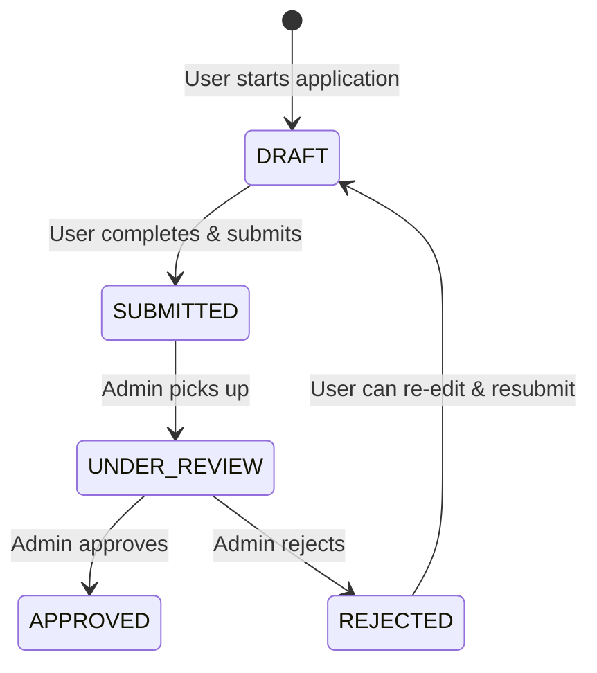
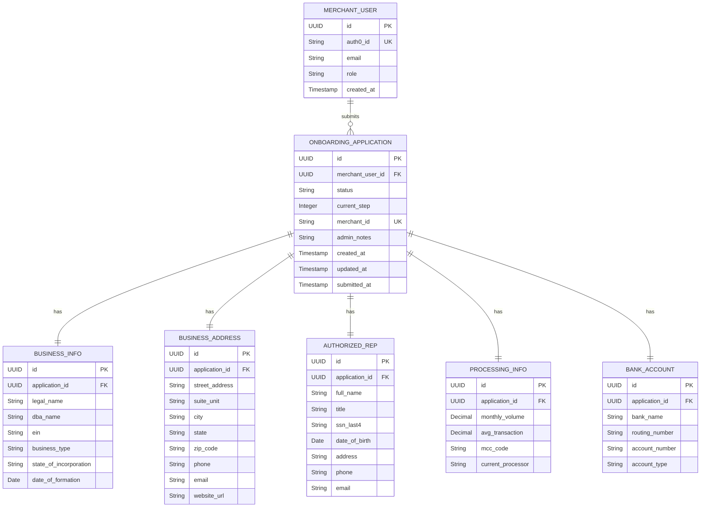

# PRD — PranayBank B2B Merchant Onboarding Platform

> **Version**: 1.0  
> **Date**: 2026-03-01  
> **Author**: Solo Developer  
> **Timeline**: NA  
> **Status**: Draft — Awaiting Approval

---

## 1. Executive Summary

Build an end-to-end **B2B merchant onboarding platform** for **PranayBank** that allows US-based merchants to self-register, submit a multi-step onboarding application to accept card payments, and track their application status. Internal bank employees (admins) can review, approve, or reject applications through a dashboard. The platform uses a **microfrontend architecture** (React 18 + Vite Module Federation) on the frontend and a **Spring Boot 3.x** monolith backend, with **Auth0** for authentication and **Neon PostgreSQL** for persistence.

---

## 2. Problem Statement

PranayBank needs a digital portal to onboard commercial card merchants. Currently there is no self-service flow — merchant intake is manual and error-prone. This platform provides:

- A structured, multi-step self-service onboarding form for merchants
- An internal admin dashboard for application review and management
- Role-based access control separating merchant and internal employee capabilities

---

## 3. User Personas

| Persona           | Role    | Description                                                                                                                                               |
| ----------------- | ------- | --------------------------------------------------------------------------------------------------------------------------------------------------------- |
| **Bank Admin**    | `ADMIN` | Internal PranayBank employee. Pre-seeded by super admin. Full access: view all applications, approve/reject, manage clients, view dashboard stats.        |
| **Merchant User** | `USER`  | External B2B client. Self-registers via Auth0. Can create/edit onboarding applications, save drafts, view approval status, and see post-approval details. |

---

## 4. Functional Requirements

### 4.1 Authentication & Authorization

| ID      | Requirement                                                                                |
| ------- | ------------------------------------------------------------------------------------------ |
| AUTH-01 | Auth0 integration with OAuth2/OIDC for login/logout                                        |
| AUTH-02 | Two roles: `ADMIN` (internal) and `USER` (merchant)                                        |
| AUTH-03 | Admin accounts are pre-seeded in Auth0 (no self-registration for admins)                   |
| AUTH-04 | Merchant users self-register through the Auth0 signup flow                                 |
| AUTH-05 | JWT tokens with role claims used for API authorization                                     |
| AUTH-06 | Protected routes: Admin dashboard accessible only to `ADMIN`, client portal only to `USER` |

---

### 4.2 Onboarding Form — Multi-Step Stepper (Merchant / `USER` role)

A **6-step wizard** with progress indicator and draft-save capability.

#### Step 1: Business Information

| Field                                | Type        | Required | Notes                                                          |
| ------------------------------------ | ----------- | -------- | -------------------------------------------------------------- |
| Legal Business Name                  | Text        | ✅       |                                                                |
| DBA (Doing Business As)              | Text        | ❌       |                                                                |
| EIN (Employer Identification Number) | Text        | ✅       | 9-digit, format: XX-XXXXXXX                                    |
| Business Type                        | Dropdown    | ✅       | LLC, Corporation, Sole Proprietorship, Partnership, Non-Profit |
| State of Incorporation               | Dropdown    | ✅       | US states list                                                 |
| Date of Formation                    | Date Picker | ✅       |                                                                |

#### Step 2: Business Address & Contact

| Field          | Type     | Required | Notes              |
| -------------- | -------- | -------- | ------------------ |
| Street Address | Text     | ✅       |                    |
| Suite/Unit     | Text     | ❌       |                    |
| City           | Text     | ✅       |                    |
| State          | Dropdown | ✅       | US states          |
| ZIP Code       | Text     | ✅       | 5-digit or 9-digit |
| Business Phone | Text     | ✅       | US phone format    |
| Business Email | Email    | ✅       |                    |
| Website URL    | URL      | ❌       |                    |

#### Step 3: Authorized Representative

| Field               | Type        | Required | Notes                      |
| ------------------- | ----------- | -------- | -------------------------- |
| Full Name           | Text        | ✅       |                            |
| Title / Designation | Text        | ✅       | e.g., CEO, Owner, Director |
| SSN (Last 4 Digits) | Text        | ✅       | Masked input               |
| Date of Birth       | Date Picker | ✅       | Must be 18+                |
| Personal Address    | Text        | ✅       | Street, City, State, ZIP   |
| Phone Number        | Text        | ✅       |                            |
| Email               | Email       | ✅       |                            |

#### Step 4: Processing Information

| Field                             | Type              | Required | Notes                              |
| --------------------------------- | ----------------- | -------- | ---------------------------------- |
| Estimated Monthly Card Volume ($) | Number            | ✅       |                                    |
| Average Transaction Amount ($)    | Number            | ✅       |                                    |
| Industry / MCC Code               | Dropdown + Search | ✅       | Pre-populated list of MCC codes    |
| Current Payment Processor         | Text              | ❌       | If switching from another provider |

#### Step 5: Bank Account Details

| Field                  | Type  | Required | Notes                      |
| ---------------------- | ----- | -------- | -------------------------- |
| Bank Name              | Text  | ✅       |                            |
| Routing Number         | Text  | ✅       | 9-digit ABA routing number |
| Account Number         | Text  | ✅       | Masked display             |
| Confirm Account Number | Text  | ✅       | Must match above           |
| Account Type           | Radio | ✅       | Checking / Savings         |

#### Step 6: Review & Submit

| Element             | Description                                                   |
| ------------------- | ------------------------------------------------------------- |
| Summary View        | Read-only display of all data from Steps 1–5                  |
| Edit Links          | Per-section "Edit" button to navigate back to respective step |
| Terms & Conditions  | Checkbox — must accept to submit                              |
| E-Signature Consent | Checkbox — digital consent acknowledgement                    |
| Submit Button       | Transitions application status from `DRAFT` to `SUBMITTED`    |

#### Draft Save Behavior

| ID      | Requirement                                                  |
| ------- | ------------------------------------------------------------ |
| FORM-01 | Application auto-saves on step navigation (Next/Back)        |
| FORM-02 | Partial applications are saved with status `DRAFT`           |
| FORM-03 | User can resume a draft application from where they left off |
| FORM-04 | Only one active application per merchant at a time           |

---

### 4.3 Application Status Workflow



| Status         | Description                                  |
| -------------- | -------------------------------------------- |
| `DRAFT`        | Incomplete, user is still filling the form   |
| `SUBMITTED`    | User completed and submitted the application |
| `UNDER_REVIEW` | Admin has started reviewing                  |
| `APPROVED`     | Admin approved — merchant ID is generated    |
| `REJECTED`     | Admin rejected — user can edit and resubmit  |

---

### 4.4 Admin Dashboard (`ADMIN` role)

| ID      | Requirement                                                                                         |
| ------- | --------------------------------------------------------------------------------------------------- |
| DASH-01 | **Quick stats cards**: Total Applications, Pending (Submitted + Under Review), Approved, Rejected   |
| DASH-02 | **Application list view**: Table with columns — Business Name, EIN, Status, Submitted Date, Actions |
| DASH-03 | **Filters**: By status (all, submitted, under review, approved, rejected) and by date range         |
| DASH-04 | **Detail view**: Click an application to see full submitted data (all 5 steps)                      |
| DASH-05 | **Approve/Reject actions**: With optional admin notes/comments                                      |
| DASH-06 | **Status change**: Approve generates a unique Merchant ID (format: `PB-XXXXXXXX`)                   |
| DASH-07 | **Console notification**: Status changes are logged to console (simulated email notification)       |

---

### 4.5 Client Portal (`USER` role — Post-Onboarding)

| ID    | Requirement                                                                                                |
| ----- | ---------------------------------------------------------------------------------------------------------- |
| CP-01 | **Application details**: Read-only view of submitted onboarding data                                       |
| CP-02 | **Status tracker**: Visual stepper/progress bar showing current application status                         |
| CP-03 | **Merchant account info** (post-approval): Display assigned Merchant ID, approval date, and account status |
| CP-04 | If application is `REJECTED`, show rejection reason and allow user to edit & resubmit                      |
| CP-05 | If application is `DRAFT`, show "Continue Application" CTA                                                 |

---

## 5. Technical Architecture

### 5.1 High-Level Architecture

```
┌──────────────────────────────────────────────────────┐
│                    FRONTEND (React 18)                │
│                                                       │
│  ┌─────────────┐  ┌──────────────┐  ┌──────────────┐ │
│  │  Shell App   │  │ Onboarding   │  │  Dashboard   │ │
│  │  (Host)      │◄─┤ MFE (Remote) │  │ MFE (Remote) │ │
│  │  - Layout    │  │ - 6-step     │  │ - Admin      │ │
│  │  - Routing   │  │   stepper    │  │   views      │ │
│  │  - Auth      │  │ - Draft save │  │ - Stats      │ │
│  │  - Nav       │  │ - Client     │  │ - Approve/   │ │
│  │              │  │   portal     │  │   Reject     │ │
│  └──────┬───────┘  └──────────────┘  └──────────────┘ │
│         │         Vite + Module Federation              │
└─────────┼───────────────────────────────────────────────┘
          │ HTTPS (JWT Bearer)
          ▼
┌───────────────────────────┐     ┌──────────────────┐
│   Spring Boot 3.x Backend │────►│  Neon PostgreSQL  │
│   (Java 17)               │     │  (Free Tier)      │
│   - REST APIs             │     └──────────────────┘
│   - Auth0 JWT validation  │
│   - JPA / Hibernate       │     ┌──────────────────┐
│   - Role-based access     │────►│  Auth0            │
│                           │     │  (OIDC Provider)  │
└───────────────────────────┘     └──────────────────┘
```

### 5.2 Tech Stack

| Layer                  | Technology                                                      |
| ---------------------- | --------------------------------------------------------------- |
| **Frontend Framework** | React 18                                                        |
| **Bundler**            | Vite 5 with `@originjs/vite-plugin-federation`                  |
| **State Management**   | React Context + `useReducer` (lightweight, no Redux needed)     |
| **HTTP Client**        | Axios                                                           |
| **UI Components**      | MUI (Material UI) v5 — for stepper, tables, cards, forms        |
| **Auth (Frontend)**    | `@auth0/auth0-react` SDK                                        |
| **Backend Framework**  | Spring Boot 3.x (Java 17)                                       |
| **Security**           | Spring Security + OAuth2 Resource Server (Auth0 JWT validation) |
| **ORM**                | Spring Data JPA + Hibernate                                     |
| **Database**           | Neon PostgreSQL (free tier)                                     |
| **API Style**          | REST (JSON)                                                     |
| **CI/CD**              | GitHub Actions                                                  |

### 5.3 Microfrontend Architecture

| App              | Type   | Port (Dev) | Responsibilities                                                                   |
| ---------------- | ------ | ---------- | ---------------------------------------------------------------------------------- |
| `shell-app`      | Host   | 3000       | Layout, navigation, routing, Auth0 provider, role-based route guards               |
| `onboarding-mfe` | Remote | 3001       | Onboarding stepper form, draft save, client portal (status tracker, merchant info) |
| `dashboard-mfe`  | Remote | 3002       | Admin dashboard, application list, detail view, approve/reject, quick stats        |

**Module Federation Config**:

- Shell app dynamically loads `onboarding-mfe` and `dashboard-mfe` at runtime
- Shared dependencies: `react`, `react-dom`, `react-router-dom`, `@auth0/auth0-react`
- Each MFE exposes a root component (e.g., `./OnboardingApp`, `./DashboardApp`)

---

## 6. Data Model

### 6.1 Entity Diagram



---

## 7. API Contract

### 7.1 Authentication

All APIs prefixed with `/api/v1`. Auth via `Authorization: Bearer <JWT>` header.

### 7.2 Endpoints

#### Application APIs (Merchant `USER`)

| Method | Endpoint                                      | Description                    | Auth               |
| ------ | --------------------------------------------- | ------------------------------ | ------------------ |
| `POST` | `/api/v1/applications`                        | Create a new draft application | USER               |
| `GET`  | `/api/v1/applications/me`                     | Get current user's application | USER               |
| `PUT`  | `/api/v1/applications/{id}/step/{stepNumber}` | Save data for a specific step  | USER               |
| `POST` | `/api/v1/applications/{id}/submit`            | Submit completed application   | USER               |
| `GET`  | `/api/v1/applications/{id}`                   | Get application details        | USER (own) / ADMIN |

#### Admin APIs

| Method | Endpoint                                 | Description                        | Auth  |
| ------ | ---------------------------------------- | ---------------------------------- | ----- |
| `GET`  | `/api/v1/admin/applications`             | List all applications (filterable) | ADMIN |
| `GET`  | `/api/v1/admin/applications/{id}`        | View application detail            | ADMIN |
| `PUT`  | `/api/v1/admin/applications/{id}/status` | Update status (approve/reject)     | ADMIN |
| `GET`  | `/api/v1/admin/stats`                    | Dashboard quick stats              | ADMIN |

#### User Management

| Method | Endpoint             | Description                                | Auth       |
| ------ | -------------------- | ------------------------------------------ | ---------- |
| `POST` | `/api/v1/users/sync` | Sync Auth0 user to local DB on first login | USER/ADMIN |
| `GET`  | `/api/v1/users/me`   | Get current user profile                   | USER/ADMIN |

### 7.3 Key Request/Response Examples

**PUT** `/api/v1/applications/{id}/step/1` (Save Business Info)

```json
{
  "legalName": "ACME Payments LLC",
  "dbaName": "ACME Pay",
  "ein": "12-3456789",
  "businessType": "LLC",
  "stateOfIncorporation": "DE",
  "dateOfFormation": "2020-01-15"
}
```

**PUT** `/api/v1/admin/applications/{id}/status` (Admin approve/reject)

```json
{
  "status": "APPROVED",
  "adminNotes": "All documents verified. Merchant ID assigned."
}
```

**GET** `/api/v1/admin/stats` (Dashboard stats response)

```json
{
  "totalApplications": 42,
  "pending": 8,
  "approved": 30,
  "rejected": 4
}
```

---

## 8. UI Wireframe Descriptions

### 8.1 Shell App — Layout

- **Top Navbar**: PranayBank logo (left), navigation links (center), user avatar + logout (right)
- **Sidebar** (admin only): Dashboard, Applications, Settings
- **Content Area**: Renders MFE content
- **Footer**: © PranayBank 2026

### 8.2 Onboarding Stepper

- **Horizontal stepper** at top showing Steps 1–6 with labels
- Active step highlighted, completed steps show checkmark
- Form fields rendered per step with validation
- **Back / Next / Save Draft** buttons at bottom
- Step 6 shows full summary with edit links per section

### 8.3 Admin Dashboard

- **Stats Row**: 4 cards — Total, Pending, Approved, Rejected (with counts and icons)
- **Filters Bar**: Status dropdown, date range picker, search input
- **Applications Table**: Sortable columns — Business Name, EIN, Status (colored badge), Date, Actions (View button)
- **Detail Modal/Page**: Full application data in accordion sections + Approve/Reject buttons at bottom

### 8.4 Client Portal

- **Status Tracker**: Horizontal stepper showing DRAFT → SUBMITTED → UNDER REVIEW → APPROVED/REJECTED
- **Application Summary**: Accordion sections showing submitted data (read-only)
- **Merchant Info Card** (if approved): Merchant ID, approval date, account status badge
- **Action Buttons**: "Edit & Resubmit" (if rejected), "Continue Application" (if draft)

---

## 9. Deployment Architecture

```
┌─────────────┐    ┌─────────────┐    ┌─────────────┐
│  Vercel #1   │    │  Vercel #2   │    │  Vercel #3   │
│  Shell App   │    │  Onboarding  │    │  Dashboard   │
│  (Host)      │    │  MFE         │    │  MFE         │
└──────┬───────┘    └──────────────┘    └──────────────┘
       │
       ▼ API calls
┌─────────────────┐    ┌──────────────┐
│  Render.com      │───►│  Neon DB      │
│  Spring Boot API │    │  PostgreSQL   │
└─────────────────┘    └──────────────┘
       │
       ▼ JWT validation
┌──────────────┐
│  Auth0        │
│  (Cloud)      │
└──────────────┘
```

| Service        | Platform   | Tier | URL Pattern                        |
| -------------- | ---------- | ---- | ---------------------------------- |
| Shell App      | Vercel     | Free | `pranaybank.vercel.app`            |
| Onboarding MFE | Vercel     | Free | `pranaybank-onboarding.vercel.app` |
| Dashboard MFE  | Vercel     | Free | `pranaybank-dashboard.vercel.app`  |
| Backend API    | Render.com | Free | `pranaybank-api.onrender.com`      |
| Database       | Neon       | Free | (connection string in env vars)    |
| Auth Provider  | Auth0      | Free | `pranaybank.auth0.com`             |

> [!NOTE]
> Render.com free tier has **cold starts** (~30s spin-up after inactivity). This is acceptable for a demo.

---

## 10. CI/CD — GitHub Actions

### Repository Structure (Monorepo)

```
pranaybank-onboarding/
├── .github/
│   └── workflows/
│       ├── backend.yml        # Build & deploy Spring Boot
│       ├── shell-app.yml      # Build & deploy Shell MFE
│       ├── onboarding-mfe.yml # Build & deploy Onboarding MFE
│       └── dashboard-mfe.yml  # Build & deploy Dashboard MFE
├── backend/                   # Spring Boot app
├── frontend/
│   ├── shell-app/             # Host MFE
│   ├── onboarding-mfe/        # Remote MFE
│   └── dashboard-mfe/         # Remote MFE
└── README.md
```

### Pipeline Triggers

- **Backend**: On push to `main` with changes in `backend/**`
- **Each MFE**: On push to `main` with changes in respective `frontend/<mfe>/**` path
- Each pipeline: Install → Build → Deploy

---

## 11. Auth0 Setup Requirements

| Item                          | Value                                                                      |
| ----------------------------- | -------------------------------------------------------------------------- |
| **Tenant**                    | `pranaybank` (to be created on auth0.com)                                  |
| **Application Type**          | Single Page Application (SPA)                                              |
| **Allowed Callback URLs**     | `http://localhost:3000/callback`, `https://pranaybank.vercel.app/callback` |
| **Allowed Logout URLs**       | `http://localhost:3000`, `https://pranaybank.vercel.app`                   |
| **API Identifier (Audience)** | `https://pranaybank-api`                                                   |
| **Roles**                     | `ADMIN`, `USER` (configured in Auth0 dashboard)                            |
| **Rule/Action**               | Add role claim to JWT: `https://pranaybank.com/roles`                      |
| **Pre-seeded Admin**          | Create admin user manually in Auth0 and assign `ADMIN` role                |

---

## 12. Non-Functional Requirements

| Category            | Requirement                                                                                    |
| ------------------- | ---------------------------------------------------------------------------------------------- |
| **Responsiveness**  | Desktop-first, basic mobile responsiveness                                                     |
| **Browser Support** | Chrome, Firefox, Edge (latest versions)                                                        |
| **Performance**     | API response < 500ms for standard operations                                                   |
| **Security**        | HTTPS in production, CORS configured, input validation (front + back), sensitive fields masked |
| **Notifications**   | Simulated via console.log (not real email)                                                     |
| **Testing**         | Skipped for 1-day scope                                                                        |
| **Error Handling**  | User-friendly error messages, API error responses with proper HTTP codes                       |

---

## 13. Risks & Mitigations

| Risk                                                      | Impact | Mitigation                                                                      |
| --------------------------------------------------------- | ------ | ------------------------------------------------------------------------------- |
| Module Federation plugin compatibility issues with Vite 5 | High   | Fall back to simple multi-app routing with shared Auth0 context                 |
| Auth0 setup complexity                                    | Medium | Use Auth0's React quickstart template, pre-configure tenant                     |
| Render.com cold starts                                    | Low    | Acceptable for demo; add loading spinner in UI                                  |
| 1-day timeline is tight                                   | High   | Prioritize: Auth → Stepper → Admin List → Client Portal. Skip polish if needed. |
| Neon free tier limits (0.5 GB storage)                    | Low    | More than enough for demo data                                                  |

---

## 14. Development Timeline (1 Day)

| Block              | Duration | Tasks                                                                                                                                              |
| ------------------ | -------- | -------------------------------------------------------------------------------------------------------------------------------------------------- |
| **Setup**          | 1 hr     | Auth0 tenant setup, Neon DB creation, project scaffold (backend + 3 MFEs), module federation config                                                |
| **Backend**        | 2.5 hrs  | Data model + JPA entities, REST controllers (application CRUD, admin endpoints, user sync), Auth0 JWT security config, application status workflow |
| **Shell App**      | 1 hr     | Auth0 integration, routing, layout, role-based route guards, module federation host config                                                         |
| **Onboarding MFE** | 2 hrs    | 6-step stepper form, draft save logic, form validation, submit flow, client portal (status tracker + merchant info)                                |
| **Dashboard MFE**  | 1.5 hrs  | Stats cards, applications table with filters, detail view, approve/reject actions                                                                  |
| **Deployment**     | 1 hr     | GitHub Actions workflows (4 pipelines), Vercel deployments (3), Render deployment (1), env vars config                                             |
| **Buffer**         | 1 hr     | Bug fixes, integration testing, polish                                                                                                             |

**Total: ~10 hours**

---

## 15. Out of Scope (v1)

- Real email/SMS notifications
- Document/file uploads
- Multi-tenancy
- Audit trail / activity logs
- Advanced search (Elasticsearch)
- Rate limiting / throttling
- Internationalization (i18n)
- Automated testing (unit, integration, E2E)
- Production-grade deployment (AWS/GCP/Azure)

---

## 16. Success Criteria

- [ ] User can self-register via Auth0 and log in
- [ ] User can complete the 6-step onboarding form and submit
- [ ] User can save and resume draft applications
- [ ] Admin can view all applications with filters and stats
- [ ] Admin can approve or reject applications
- [ ] Approved merchants see their Merchant ID in the client portal
- [ ] Rejected merchants can edit and resubmit
- [ ] All 3 MFEs load correctly via Module Federation
- [ ] Application is deployed and accessible via public URLs
- [ ] CI/CD pipelines trigger on push to main
